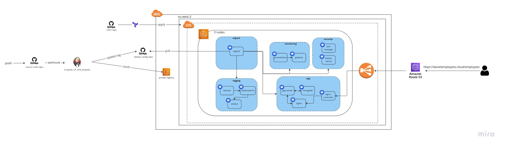

# Employees DevOps portfolio
## Source code repository
This repository contains the source code of a simple RESTful application. It includes a Dockerfile to dockerize the app, a docker-compose file that the tests run against in the CI pipeline, and a Jenkinsfile that runs in the MBP Jenkins job. 

## Requirments
#### Jenkins
1. Setup Jenkins as a container in an EC2 instance with Docker, Docker Compose, and AWS CLI installed. Refer to this [GitHub repository](https://github.com/Daniel-Yakov/jenkins-setup) for instructions.
2. Install the following Jenkins plugins: `Docker Pipeline`, `Multibranch Scan Webhook Trigger` and `Slack Notification Plugin`.
3. Configure the necessary SSH keys.
4. Add the credential `github` of type "Secret text" to Jenkins. This should contain the generated token from GitHub personal access token (classic) with the repo scope checked.
5. Add the credential `slack-token` of type "Secret text" to Jenkins and configure the `Slack Notification Plugin` in the Configure System (requires a Slack app).
6. In the Jenkinsfile, ensure that the `--network` specified in the 'unit_test' stage matches the network of the Jenkins container.

#### Amazon Elastic Container Registry (ECR)
1. Create an ECR private repository.
2. Ensure that the correct repository name is specified in the Jenkinsfile under the 'publish' stage.
3. Attach an EC2 role with the following permissions: `ecr:CompleteLayerUpload`, `ecr:UploadLayerPart`, `ecr:InitiateLayerUpload`, `ecr:BatchCheckLayerAvailability`, `ecr:PutImage` and `ecr:GetAuthorizationToken`

#### Docker Compose
1. In the Docker Compose file, ensure that the networks section specifies the same network as the Jenkins container.

## Additional Information
It's worth noting that this configuration repository is intended to be used in conjunction with the source code repository and infrastructure repository to provide a complete DevOps solution for the application.
[Infrastructure GitHub Repository](https://github.com/Daniel-Yakov/portfolio-infra)
[GitOps Config GitHub Repository](https://github.com/Daniel-Yakov/employees-gitops-config)
